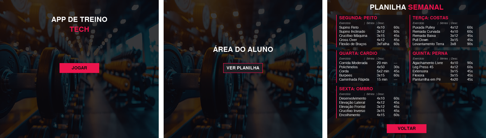

# Tela de Treino de Academia

Aplicativo de desktop feito em Python com [Pygame](https://www.pygame.org) que
mostra a planilha semanal de treino de um aluno de academia, com tema escuro e
detalhes em rosa.



## Telas

1. **Menu**: título do app e botão "JOGAR".
2. **Área do aluno**: botão "VER PLANILHA".
3. **Planilha semanal**: um cartão para cada dia, de segunda a sexta, com cinco
   exercícios, as séries e o tempo de descanso de cada um, e o botão "VOLTAR".

## O que o projeto mostra

- **Navegação por estados**: uma variável (`menu`, `jogo` ou `opcoes`) define
  qual tela é desenhada a cada quadro.
- **Botões clicáveis** com `pygame.Rect` e detecção de colisão com o mouse.
- **Som de clique** nos botões, com `pygame.mixer`.
- **Imagem de fundo** redimensionada para a janela, com uma película escura por
  cima para destacar o texto.
- **Cartões com transparência**, desenhados em superfícies com canal alfa.
- **Dados separados do desenho**: a planilha fica em um dicionário, e a tela é
  montada percorrendo esse dicionário.
- **Tratamento de erros**: se o som ou a imagem não carregarem, o app avisa no
  terminal e continua funcionando, sem áudio ou com fundo liso.

## Planilha

| Dia | Treino | Exercícios |
| --- | --- | --- |
| Segunda | Peito | Supino Reto, Supino Inclinado, Crucifixo Máquina, Cross Over, Flexão de Braços |
| Terça | Costas | Puxada Pulley, Remada Curvada, Remada Baixa, Pull Down, Levantamento Terra |
| Quarta | Cardio | Corrida Moderada, Polichinelos, Corda, Burpees, Caminhada Rápida |
| Quinta | Perna | Agachamento Livre, Leg Press 45, Extensora, Flexora, Panturrilha em Pé |
| Sexta | Ombro | Desenvolvimento, Elevação Lateral, Elevação Frontal, Crucifixo Inverso, Encolhimento |

## Como rodar

Precisa de Python 3.

```bash
git clone https://github.com/Dv-TiagoCarvalho/tela_treinoAcademia.git
cd tela_treinoAcademia
python3 -m venv .venv
source .venv/bin/activate        # no Windows: .venv\Scripts\activate
pip install pygame-ce
python tela.py
```

O `pygame-ce` é a edição da comunidade do Pygame: usa o mesmo `import pygame` e
funciona também no Python 3.14. Em versões do Python até a 3.13, o `pygame`
tradicional (`pip install pygame`) também serve.

O programa precisa ser executado de dentro da pasta do projeto, porque procura a
imagem e o som na pasta atual.

## Arquivos

```
tela.py            Código do app: janela, telas, botões e planilha
academia.jpg       Imagem de fundo
clique.wav2.mp3    Som do clique nos botões
telas.png          Imagem usada neste README
```

## Como personalizar

- **Treinos**: edite o dicionário `planilha_detalhada`, em `tela.py`. Cada
  exercício é uma tupla com nome, séries e descanso.
- **Cores**: altere `ROSA_TECH`, `FUNDO_CARD` e as outras cores no início do
  arquivo.
- **Tamanho da janela**: altere `LARGURA` e `ALTURA`.

## Ideias de melhoria

- Marcar exercícios como concluídos
- Cronômetro para o tempo de descanso
- Carregar e salvar a planilha em um arquivo
- Efeito visual ao passar o mouse sobre os botões

## Autor

Tiago Carvalho — [github.com/Dv-TiagoCarvalho](https://github.com/Dv-TiagoCarvalho)
